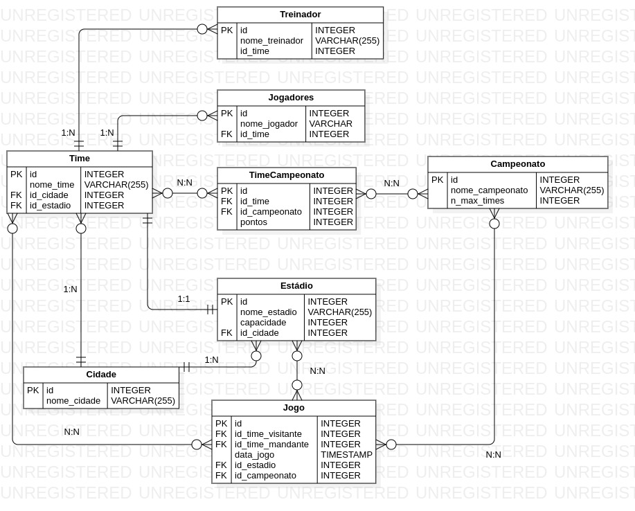

# User Stories

## Tabela de Classificação

Eu, como organizador de campeonatos, desejo ter um sistema capaz de exibir a classificação dos times e adicionar/atualizar/deletar as pontuações.

## Administrando os Times

Eu, como organizador de campeonatos, desejo ter um sistema capaz de adicionar/remover/atualizar os times que estão competindo.

## Tabela de Jogos

Eu, como organizador de campeonatos, desejo ter um sistema capaz de definir a data dos confrontos dos times. Caso haja
algum erro, quero ser capaz de atualizar/remover esse dado.

# Modelo Relacional

# UML

